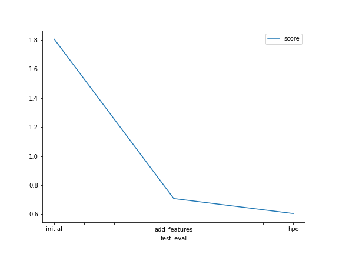

# Report: Predict Bike Sharing Demand with AutoGluon Solution
#### NAME HERE

## Initial Training
### What did you realize when you tried to submit your predictions? What changes were needed to the output of the predictor to submit your results?
must be same  colm names of submissions.csv that came with kaggle compution 

### What was the top ranked model that performed?
WeightedEnsemble_L2 

## Exploratory data analysis and feature creation
### What did the exploratory analysis find and how did you add additional features?
the date and tim col can be usefaul to breing new features that help predict dmand such as getting weekday  , the hours and extra , while season an weather  need to converted to catgorical so it can be used in auto-gloun
 
### How much better did your model preform after adding additional features and why do you think that is?

the model with new featuers get 0.7 , while without the new feature the model get
1.8  , that because  the type of problem  can benfit very from date informations
also changing weater and sesson to catgorical makes gloun use it  in a propper way

## Hyper parameter tuning
### How much better did your model preform after trying different hyper parameters?
the model after hyper parameters tuining get 0.6 which is +0.1 better then the prevuoise model

### If you were given more time with this dataset, where do you think you would spend more time?
feature engineering
### Create a table with the models you ran, the hyperparameters modified, and the kaggle score.

|model|time|presets|GBM_num_boost_round|score|
|--|--|--|--|--|
|initial|600|best_quality|none|1.80598|
|add_features|900|best_quality|none|0.70754|
|hpo|1400|high_quality_fast_inference_only_refit|900.0|0.60428|

### Create a line plot showing the top model score for the three (or more) training runs during the project.

TODO: Replace the image below with your own.

### Create a line plot showing the top kaggle score for the three (or more) prediction submissions during the project.

TODO: Replace the image below with your own.

## Summary
TODO: Add your explanation
